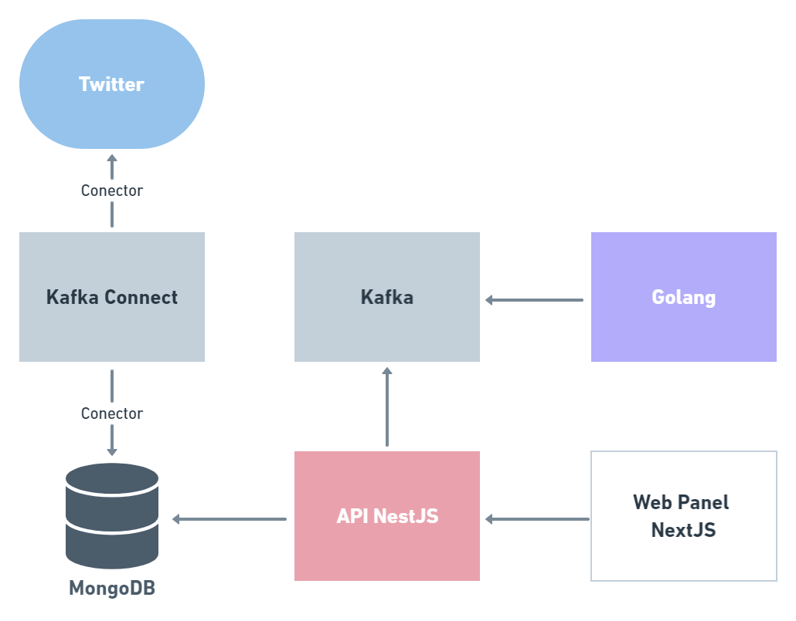

<h1 align="center">
    
</h1>

<h1 align="center">Imersão Full Cycle 6 - Monitoramento de tweets</h1>

<p align="center">👨‍💻 Monitoramento de tweets por filtragem a partir de tags 👨‍💻</p>

<h4 align="center">🚧   Concluído 🚀 🚧</h4>

---

Tabela de conteúdos
=================
<!--ts-->
   * [Sobre o projeto](#-sobre-o-projeto)
   * [Tecnologias](#-tecnologias)
   * [Arquitetura](#-arquitetura)
   * [Como executar o projeto](#-como-executar-o-projeto)
   * [Autor](#-autor)
   * [Licença](#-licenca)
<!--te-->

---

## Sobre o projeto <a name="-sobre-o-projeto" style="text-decoration:none"></a>

Sistema de monitoramento de tweets por filtragem a partir de tags. A aplicação é baseada em quatro microserviços: Kafka Connect, backend em NestJS, frontend em NextJS e serviço de envio de e-mails em Golang. 

O Twitter é monitorado através de um conector do Kafka Connect e os novos tweets encontrados são salvos no banco de dados da aplicação por meio de outro conector. A API acompanha a entrada de dados no banco e aciona o serviço do envio de e-mails quando uma determinada quantidade é atingida. Além disso, é papel da API prover por meio de endpoints REST as informações mostradas no frontend.

Os microserviços foram desenvolvidos para executar em containers Docker e, quando em produção, utilizando Kubernetes.

---

## Tecnologias <a name="-tecnologias" style="text-decoration:none"></a>

- **[Kafka](https://kafka.apache.org/)**
- **[Kafka Connect](https://docs.confluent.io/platform/current/connect/index.html#:~:text=Kafka%20Connect%20is%20a%20free,Kafka%20Connect%20for%20Confluent%20Platform.)**
- **[NodeJS](https://nodejs.org/en/)**
- **[NestJS](https://nestjs.com/)**
- **[MongoDB](https://www.mongodb.com/)**
- **[Redis](https://redis.io/)**
- **[NextJS](https://nextjs.org/)**
- **[Golang](https://go.dev/)**
- **[Docker](https://www.docker.com/)**
- **[Kubernetes](https://kubernetes.io/)**

---

## Arquitetura <a name="-arquitetura" style="text-decoration:none"></a>

<h1 align="center">
    
</h1>

---

## Como executar o projeto <a name="-como-executar-o-projeto" style="text-decoration:none"></a>

### Pré-requisitos

Antes de começar, você vai precisar ter instalado em sua máquina as seguintes ferramentas:
[Git](https://git-scm.com), [Docker](https://www.docker.com/) e [Docker Compose](https://docs.docker.com/compose/). Para trabalhar com o código, é recomendável o uso de um bom editor, como o [VSCode](https://code.visualstudio.com/).

#### Rodando a aplicação localmente

```bash

# Clone este repositório
$ git clone https://github.com/emanuelmassafera/imersao-fc6.git

# Acesse a pasta do projeto pelo terminal/cmd
$ cd imersao-fc6

# Acesse a pasta de cada microserviço
$ cd kafka-connect

# Execute a aplicação
$ docker-compose up

```

#### Variáveis de ambiente

Ao rodar localmente, todas as variáveis de ambiente já serão criadas e atribuídas através dos arquivos docker-compose de cada microserviço. As únicas exceções são das variáveis referentes ao serviço de envio de e-mail, que deverão ser substituídas.

#### Ordem de execução recomendada

A ordem de execução recomendada para os microserviços é kafka-connect > nestjs > golang > nextjs.

#### Rodando a aplicação em produção

Para executar a aplicação com Kubernetes, é necessário que você o tenha instalado em sua máquina, substitua as variáveis de ambiente para uso dos serviços do Kafka, MongoDB e Redis em cloud e suba as imagens Docker de produção dos microserviços do NestJS, NextJS e Golang para o Docker Hub. 

---

## Autor <a name="-autor" style="text-decoration:none"></a>


<sub>Emanuel Massafera</sub>

<b></b>

[](https://www.linkedin.com/in/emanuelmassafera/) [](mailto:emanuel301@live.com)

---

## Licença <a name="-licenca" style="text-decoration:none"></a>

Esse repositório está licenciado pela **MIT LICENSE**. Para informações detalhadas, leia o arquivo [LICENSE](https://github.com/emanuelmassafera/imersao-fc6/blob/main/LICENSE). 

Made with ♥ by Emanuel Massafera :wave: [Get in touch!](https://www.linkedin.com/in/emanuelmassafera/)
